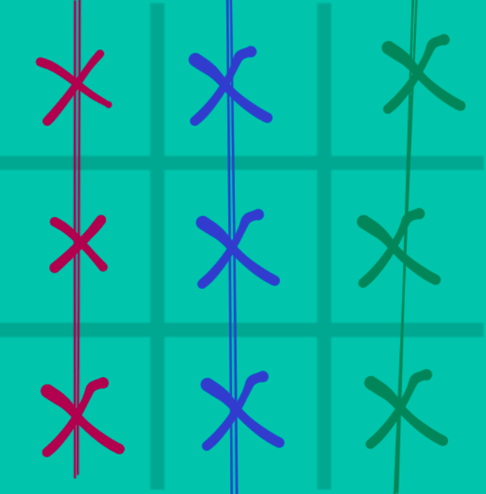

# Boas-vindas ao repositório do exercício Tik Tak Toe
#### teste
Para realizar o projeto, atente-se a cada passo descrito a seguir, e se tiver qualquer dúvida, nos envie por _Slack_! #vqv 🚀

Aqui você vai encontrar os detalhes de como estruturar o desenvolvimento do seu projeto a partir deste repositório, utilizando uma branch específica e um _Pull Request_ para colocar seus códigos.

# Termos e acordos

Ao iniciar este projeto, você concorda com as diretrizes do Código de Conduta e do Manual da Pessoa Estudante da Trybe.

# Orientações

<details>
  <summary><strong>‼️ Antes de começar a desenvolver</strong></summary><br />

  1. Clone o repositório

  - Use o comando: `git clone git@github.com:tryber/acc-csharp-0x-exercises-tik-tak-toe.git`.
  - Entre na pasta do repositório que você acabou de clonar:
    - `cd acc-csharp-0x-exercises-tik-tak-toe`

  2. Instale as dependências

  - `dotnet restore`.
  
  1. Crie uma branch a partir da branch `master`

  - Verifique que você está na branch `master`
    - Exemplo: `git branch`
  - Se não estiver, mude para a branch `master`
    - Exemplo: `git checkout master`
  - Agora crie uma branch à qual você vai submeter os `commits` do seu projeto
    - Você deve criar uma branch no seguinte formato: `nome-de-usuario-nome-do-projeto`
    - Exemplo: `git checkout -b joaozinho-acc-csharp-0x-exercises-tik-tak-toe`

  4. Adicione as mudanças ao _stage_ do Git e faça um `commit`

  - Verifique que as mudanças ainda não estão no _stage_
    - Exemplo: `git status` (deve aparecer listada a pasta _joaozinho_ em vermelho)
  - Adicione o novo arquivo ao _stage_ do Git
    - Exemplo:
      - `git add .` (adicionando todas as mudanças - _que estavam em vermelho_ - ao stage do Git)
      - `git status` (deve aparecer listado o arquivo _joaozinho/README.md_ em verde)
  - Faça o `commit` inicial
    - Exemplo:
      - `git commit -m 'iniciando o projeto x'` (fazendo o primeiro commit)
      - `git status` (deve aparecer uma mensagem tipo _nothing to commit_ )

  5. Adicione a sua branch com o novo `commit` ao repositório remoto

  - Usando o exemplo anterior: `git push -u origin joaozinho-acc-csharp-0x-exercises-tik-tak-toe`

  6. Crie um novo `Pull Request` _(PR)_

  - Vá até a página de _Pull Requests_ do [repositório no GitHub](https://github.com/tryber/acc-csharp-0x-exercises-tik-tak-toe/pulls)
  - Clique no botão verde _"New pull request"_
  - Clique na caixa de seleção _"Compare"_ e escolha a sua branch **com atenção**
  - Coloque um título para a sua _Pull Request_
    - Exemplo: _"Cria tela de busca"_
  - Clique no botão verde _"Create pull request"_
  - Adicione uma descrição para o _Pull Request_ e clique no botão verde _"Create pull request"_
  - **Não se preocupe em preencher mais nada por enquanto!**
  - Volte até a [página de _Pull Requests_ do repositório](https://github.com/tryber/acc-csharp-0x-exercises-tik-tak-toe/pulls) e confira que o seu _Pull Request_ está criado

</details>

<details>
  <summary><strong>⌨️ Durante o desenvolvimento</strong></summary><br/>

  - Faça `commits` das alterações que você fizer no código regularmente

  - Lembre-se de sempre após um (ou alguns) `commits` atualizar o repositório remoto

  - Os comandos que você utilizará com mais frequência são:
    1. `git status` _(para verificar o que está em vermelho - fora do stage - e o que está em verde - no stage)_
    2. `git add` _(para adicionar arquivos ao stage do Git)_
    3. `git commit` _(para criar um commit com os arquivos que estão no stage do Git)_
    4. `git push -u origin nome-da-branch` _(para enviar o commit para o repositório remoto na primeira vez que fizer o `push` de uma nova branch)_
    5. `git push` _(para enviar o commit para o repositório remoto após o passo anterior)_

</details>

<details>
  <summary><strong>🤝 Depois de terminar o desenvolvimento (opcional)</strong></summary><br/>

  Para sinalizar que o seu projeto está pronto para o _"Code Review"_, faça o seguinte:

  - Vá até a página **DO SEU** _Pull Request_, adicione a label de _"code-review"_ e marque seus colegas:

    - No menu à direita, clique no _link_ **"Labels"** e escolha a _label_ **code-review**;

    - No menu à direita, clique no _link_ **"Assignees"** e escolha **o seu usuário**;

    - No menu à direita, clique no _link_ **"Reviewers"** e digite `students`, selecione o time `tryber/students-sd-0x`.

  Caso tenha alguma dúvida, [aqui tem um video explicativo](https://vimeo.com/362189205).

</details>

<details>
  <summary><strong>🕵🏿 Revisando um pull request</strong></summary><br />

  Use o conteúdo sobre [Code Review](https://course.betrybe.com/real-life-engineer/code-review/) para te ajudar a revisar os _Pull Requests_.

</details>

<details>
  <summary><strong>🎛 Linter</strong></summary><br />

  Usaremos o [NetAnalyzer](https://docs.microsoft.com/pt-br/dotnet/fundamentals/code-analysis/overview) para fazer a análise estática do seu código.

  Este projeto já vem com as dependências relacionadas ao _linter_ configuradas no arquivo `main.yml`.

  O analisador já é instalado pelo plugin da `Microsoft C#` no `VSCode`. Para isso, basta fazer o download do [plugin](https://marketplace.visualstudio.com/items?itemName=ms-dotnettools.csharp) e instalá-lo.
</details>

<details>
  <summary><strong>🛠 Testes</strong></summary><br />

  O .NET já possui sua própria plataforma de testes.
  
  Este projeto já vem configurado e com suas dependências

  ### Executando todos os testes

  Para executar os testes com o .NET execute o comando dentro do diretório do seu projeto `src/TikTakToe` ou de seus testes `src/TikTakToe.Test`!

  ```
  dotnet test
  ```

  ### Executando um teste específico

  Para executar um teste expecífico basta executar o comando `dotnet test --filter Name~TestMethod1`.

  :warning: **Importante:** o comando irá executar testes cujo nome contém `TestMethod1`.

  :warning: **O avaliador automático não necessariamente avalia seu projeto na ordem em que os requisitos aparecem no readme. Isso acontece para deixar o processo de avaliação mais rápido. Então, não se assuste se isso acontecer, ok?**

  ### Outras opções para testes
  - Algumas opções que podem lhe ajudar são:
    -  `-?|-h|--help`: exibem a descrição completa de como utilizar o comando.
    -  `-t|--list-tests`: lista todos os testes ao invés de executá-los.
    -  `-v|--verbosity <LEVEL>`: define o nível de detalhe na resposta dos testes.
      - `q | quiet`
      - `m | minimal`
      - `n | normal`
      - `d | detailed`
      - `diag | diagnostic`
      - Exemplo de uso: 
         ```
           dotnet test -v diag
         ```
         ou
         ```            
           dotnet test --verbosity=diagnostic
         ``` 
</details>

<details>
  <summary><strong>🗣 Nos dê feedbacks sobre o projeto!</strong></summary><br />

Ao finalizar e submeter o projeto, não se esqueça de avaliar sua experiência preenchendo o formulário. 
**Leva menos de 3 minutos!**

[FORMULÁRIO DE AVALIAÇÃO DE PROJETO](https://be-trybe.typeform.com/to/PsefzL2e)

</details>

<details>
  <summary><strong>🗂 Compartilhe seu portfólio!</strong></summary><br />

  Você sabia que o LinkedIn é a principal rede social profissional e compartilhar o seu aprendizado lá é muito importante para quem deseja construir uma carreira de sucesso? Compartilhe esse projeto no seu LinkedIn, marque o perfil da Trybe (@trybe) e mostre para a sua rede toda a sua evolução.

</details>

# Requisitos

Hoje vamos construir o famoso jogo _Tik Tak Toe_, conhecido no Brasil como o `Jogo da velha` 👵🏾. 

E para quem não conhece, este jogo é jogado por 2 pessoas, aqui vamos chamar de `Jogador 1` e `Jogador 2`. O jogo consiste em um tabuleiro 3x3 (3 linhas e 3 colunas) e cada jogador escolhe uma posição vazia do tabuleiro para preencher. O `Jogador 1` preenche com `x` e o `Jogador 2` com `o`. O objetivo do jogo é formar uma sequência de 3 simbolos `x` ou `o` na diagonal, vertical ou horizontal. Então se qualquer sequência de 3 símbolos for formada, o jogador referente a aquele símbolo ganha.

Pra exemplificar, olha os exemplos pra vitória do `Jogador 1` que joga utilizando o `x`.
 - Nas 3 posições possíveis da horizontal:

 

 - Nas 3 posições possíveis da vertical:

 

 - Na 2 posições possíveis da diagonal:

 

A sequência do jogo fica assim:
 1. Jogador 1 escolhe uma casa vazia para preecher (linha x coluna)
 2. É realizado a verificação se algum jogador ganhou, ou deu empate (todas as casas foram preenchidas e nenhum jogador ganhou)
 3. Jogador 2 escolhe uma casa vazia para preencher (linha x coluna)
 4. É realizado a verificação se algum jogador ganhou, ou deu empate (todas as casas foram preenchidas e nenhum jogador ganhou)
E esse ciclo é repetido até que aconteça um empate ou algum jogador vença.

>>**🚨Importante🚨**: Toda a sua lógica deve ser desenvolvida na classe `TikTakToeGame` no arquivo `src/tik-tak-toe/TikTakToeGame.cs`. Algumas funções já foram dispostas e precisam ter o seu código complementado para cumprir os requisitos.
>> Para cada requisito do README, você verá dois requisitos associados no avaliador. Isso acontece porque para avaliar os testes deste projeto, o avaliador irá realizar dois testes: um de sucesso e um de falha. Você deve desenvolver o requisito e o seu teste para ter a aprovação em ambos.

## 1 - Preencher jogada no tabuleiro
_A sua lógica deve ser criada no arquivo `src/tik-tak-toe/TikTakToe.cs` dentro do método `makeMove`_

<details>
  <summary>A sua função deve preencher no tabuleiro onde o jogador realizou sua jogada</summary><br />

  O tabuleiro é um _array_ multidimensional de `char` com 3 linhas e 3 colunas. Casas vazias são o valor de um espaço vazio: `' '`, uma casa ocupada pelo jogador `x` estará preenchida pelo char `x` e uma ocupada por `o` estará preenchida por `o`.

Essa função recebe 3 parâmetros:
 1. O primeiro parâmetro `line` um `int` contendo a **linha** que o jogador escolheu.
 2. O segundo parâmetro `column` um `int` contendo a **coluna** que o jogador escolheu.
 3. O terceiro parâmetro `player` um `char` que representa o jogador que realizou a jogada, `x` ou `o`.

 Sua função deve usar estes parâmetros para preencher no tabuleiro `board` o valor referente a posição escolhida pelo jogador com o `char` que representa aquele jogador.

Dica: Um valor `char` precisa ser declarado utilizando aspas simples `'` as aspas duplas são usadas para representar `strings`.
</details>

<details>
  <summary>Crie os testes para a função <code>makeMove</code></summary><br />

  Implemente seu teste no arquivo `src/TikTakToe.Test/TestTikTakToeGame.cs` na função `TestMakeMove`.

O teste deve ser capaz de identificar se a função `makeMove` modifica o tabuleiro de acordo com as entradas passadas como parâmetro.
</details>

## 2 - Imprima o tabuleiro 
_A sua lógica deve ser criada no arquivo `src/TikTakToe/TikTakToe.cs` dentro do método `printBoard`_

<details>
  <summary>Ao ser executado, o seu método deve percorrer todo o tabuleiro de jogo e imprimir o estado atual do jogo no console</summary><br />
  O seu método deve imprimir o tabuleiro no seguinte formato:

  ```
  x o o
  o x x
  x o x
  ```

  Dicas: 
   - Se quiser imprimir algo no `console` sem pular para a próxima linha utilize a função `Console.Write` no lugar de `Console.WriteLine`.
   - Utilize laços de repetição aninhados (um dentro do outro) para percorrer o tabuleiro. Um percorrendo as linhas e outro para as colunas como vimos na lição de hoje.
   - Na hora de testar este requisito pode ser necessário remover espaços em branco no início e no final de uma `string` para isso você pode utilizar o método `Trim()` da seguinte forma:
      ```C#
      string myString = " String com espaços em branco ";
      myString.Trim();
      // Agora myString não tem mais espaços em branco no início e no final da string e ficou assim:
      // "String com espaços em branco"
      ```
</details>

<details>
  <summary>Crie os testes para a função <code>printBoard</code></summary><br />

Implemente seu teste no arquivo `src/TikTakToe.Test/TestTikTakToeGame.cs` na função `TestPrintBoard`.

O teste deve ser capaz de identificar se a função `printBoard` imprime corretamente o tabuleiro atual.
Lembre-se que para isso será necessário preencher a variável `board` com os valores de entrada.
Observe que existem valores de exemplo no `InlineData` que podem ser usados como referência.

>> **Será necessário utilizar a função `fromArrayToMultiDimArray` para transformar o valor em `InlineData` em um _Array_ de 2 dimensões**
</details>

## 3 - Verificar se o jogo já acabou
_A sua lógica deve ser criada no arquivo `src/TikTakToe/TikTakToe.cs` dentro do método `isGameOver`_

<details>
  <summary>A sua função deve verificar se o jogo já acabou e caso tenha acabado, armazenar o vencedor</summary><br />

Você vai usar o atributo `board` que representa o tabuleiro de jogo para verificar se o jogo já acabou da seguinte forma:
 - Verifique se um dos jogadores ganhou percorrendo o tabuleiro e procurando uma sequência de 3 `x` ou `o` nas horizontais, verticais ou diagonais. O valor do jogador vencedor `x` ou `o` deve ser passado para a variável `winner` e a função deve retornar `true`.
 - Caso não tenha nenhuma casa livre no tabuleiro, e nenhum jogador vencedor a sua função deve retornar `true` pois o jogo acabaou, porém foi empate. Neste caso associe um espaço vazio `' '` a variável `winner`.

 Dicas: 
 - Quando um jogador preecher uma casa do tabuleiro, essa ficará com o valor `x` ou `o` dependendo de qual jogador acabou de jogar.
 - Caso seja uma casa livre, o tabuleiro estará preenchido com um espaço vazio `' '`.
</details>

<details>
  <summary>Crie os testes para a função <code>isGameOver</code></summary><br />

  Implemente seu teste no arquivo `src/TikTakToe.Test/TestTikTakToeGame.cs` na função `TestIsGameOver`.

O teste deve ser capaz de identificar se a função `isGameOver` retorna corretamente se o jogo acabou baseado no estado atual do atributo `board`.
Lembre-se que para isso será necessário preencher a variável `board` com os valores de entrada.
Observe que existem valores de exemplo no `InlineData` que podem ser usados como referência.

>> **Será necessário utilizar a função `fromArrayToMultiDimArray` para transformar o valor em `InlineData` em um _Array_ de 2 dimensões**
</details>

## 4 - Mostrar resultados
_A sua lógica deve ser criada no arquivo `src/TikTakToe/TikTakToe.cs` dentro do método `printResults`_

<details>
  <summary>A sua função deve mostrar o resultado do jogo, se foi empate, vitória de <code>x</code> ou <code>o</code></summary><br />

A sua função deve usar o valor presente em `winner` para imprimir na tela o resultado da seguinte forma:
 - Caso seja empate imprimir:
    ```
    Empate! Deu velha!
    ```
 - Caso o jogador `x` ou `o` vença:
    ```
    O jogador x venceu!
    ```
    ou 
    ```
    O jogador o venceu!
    ```
</details>

<details>
  <summary>Crie os testes para a função <code>printResults</code></summary><br />

  Implemente seu teste no arquivo `src/TikTakToe.Test/TestTikTakToeGame.cs` na função `TestPrintResults`.

O teste deve ser capaz de identificar se a função `printResults` imprime corretamente o texto no _console_ dependendo do valor atual em `winner`.
Lembre-se que para isso será necessário preencher a variável `winner` com os valores de entrada.
Observe que existem valores de exemplo no `InlineData` que podem ser usados como referência.
</details>

